# Homomorphic Encryption ML Demo

## 1. Methodology

```mermaid
graph LR
    A[Customer Data] -->|Encrypt with Public Key| B(Encrypted Data)
    B --> C[ML Service]
    C -->|Apply Model on Encrypted Data| D(Encrypted Prediction)
    D -->|Return to Customer| E[Customer]
    E -->|Decrypt with Private Key| F(Final Prediction)
    
    style A fill:#f9f,stroke:#333,stroke-width:2px
    style F fill:#bbf,stroke:#333,stroke-width:2px
    style C fill:#bfb,stroke:#333,stroke-width:2px
```



## 2. Description
- **Purpose**: Privacy-preserving salary prediction using homomorphic encryption
- **Models**: Linear Regression
- **Accuracy**: High accuracy on salary prediction while maintaining data privacy
- **Other Information**: Demonstrates real-world application of homomorphic encryption in machine learning

## 3. Input / Output

| Input Data | Processing Step | Encrypted Result | Final Output |
|------------|----------------|-----------------|--------------|
| Age, Healthy Eating, Active Lifestyle, Gender | Encryption | Encrypted values | Predicted Salary |
| Customer Data | Model Calculation | Encrypted prediction | Decrypted Salary |
| Private Information | Privacy-Preserving Computation | Secure Transfer | Usable Results |


## 5. Application Interface


## 6. Implementation Details

### Components:
1. **Customer Side (cust.py)**:
   - Generates and stores private/public key pair
   - Encrypts sensitive data
   - Decrypts the result after model processing

2. **ML Company Side (servercalc.py & linmodel.py)**:
   - Receives encrypted data from customer
   - Processes data using ML model weights
   - Returns encrypted prediction
   - Never sees the actual data values

3. **Interactive Demo (app.py)**:
   - Streamlit application for visualization
   - Interactive data input
   - Real-time encryption demonstration
   - Visual representation of results

## 7. How to Run
```bash
# Install requirements
pip install phe pandas numpy scikit-learn streamlit matplotlib seaborn

# Run the Streamlit application
streamlit run app.py
```

## 8. Security Benefits
- Data remains encrypted during entire prediction process
- Model owner never sees sensitive input data
- Data owner never sees the internal model parameters
- Provides privacy while maintaining utility
